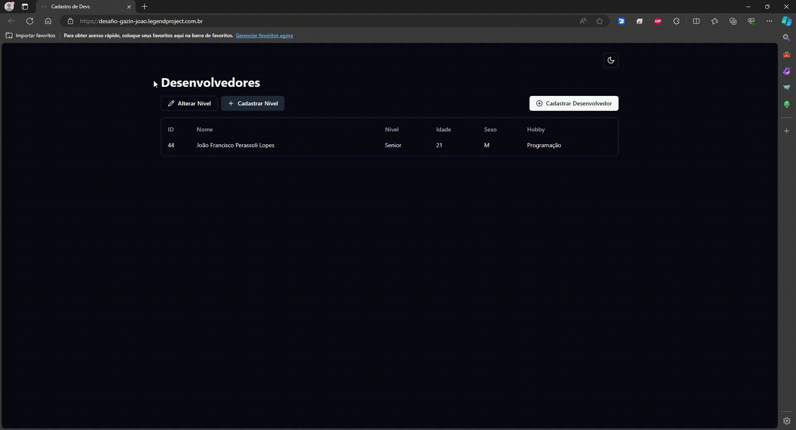
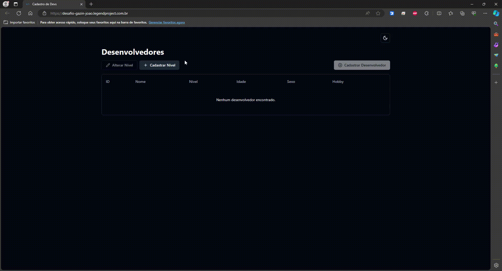
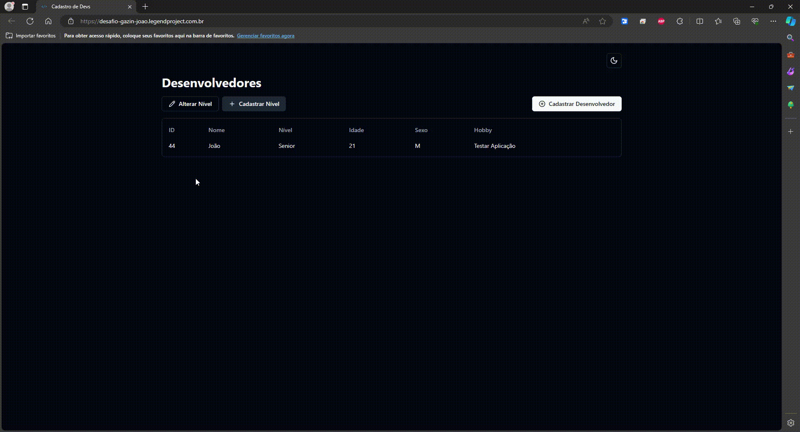

# 💻 Cadastrar Devs

Esta aplicação foi desenvolvida com o intuito de cadastrar desenvolvedores em um CRUD simples.

## 👨‍💻 Rotas de Desenvolvedores

### Cadastrar Desenvolvedor
Nesta rota, é possível cadastrar um novo desenvolvedor fornecendo as informações necessárias.

### Alterar Desenvolvedor
Esta rota permite alterar as informações de um desenvolvedor existente no sistema.

### Excluir Desenvolvedor
Utilize esta rota para remover um desenvolvedor do sistema.

## 📈 Rotas de Níveis

### Cadastrar Nível
Aqui é possível cadastrar um novo nível para os desenvolvedores.

### Alterar Nível ou Excluir nível
Utilize esta rota para modificar as informações de um nível existente, ou excluí-lo.
Só será permitida a exclusão caso não haja nenhum Desenvolvedor cadastrado no nível.

## 🎨 Temas
É possível alternar entre os temas claro ou escuro. Por padrão é selecionado o tema de seu sistema operacional

## 🧙 Tecnologias Utilizadas

### Frontend 🎨
- React ⚛
- Typescript 🔠
- Vite ⚡
- Componentes e layout com shadcn/ui 🔨
- Testes unitários feitos com Vitest 🧪
- Docker e Docker-compose 🐳
- Repositório: [frontend](https://github.com/jflopes21/desafio-fullstack)

### Backend 🌌
- Node.js 📗
- Typescript 🔠
- Express 📂
- Testes unitários feitos com Mocha e Chai ☕️
- Docker e Docker-compose 🐳
- Repositório: [backend](https://github.com/jflopes21/desafio-fullstack-api)

## 🌐 Link do Projeto em Produção 

Você pode acessar o projeto em produção [aqui](https://desafio-gazin-joao.legendproject.com.br/).

- Deploy foi realizado em um servidor próprio, porém poderia ter sido feito utilizando as plataformas:
    - Netlify: Frontend 🎨
    - Render: Backend 🌌